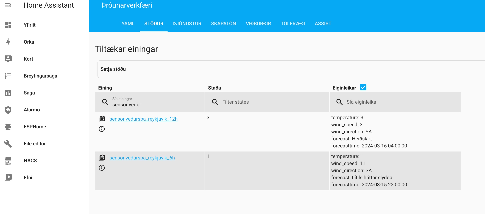

# Icelandic weather forecast

This is a complete rewrite of the previous approach to pull in icelandic weather forecast information from [vedur.is](https://vedur.is). It is now using the Pyscipt add-on of Home Assistant. The python code previously used stays mainly the same with some exceptions to get around the limitations of using the python request library. The sensor(s) are now automatically created with the python script so no need to specify them particularly in the `sensors.yaml` file.

## Installing Pyscript

Before you can use this code you will need to install the pyscript integration from HACS 

After a restart of HA you need to add Pyscript to your list of integrations.

In the upcoming window check *Allow All Imports?*

Now start by coding and placing your python scripts in the `pyscript` folder

## What will the installed code do

The python code provided is quering the vedur.is API. More specifically:

> https://xmlweather.vedur.is/?op_w=xml&type=forec&lang=is&view=xml&ids=1

whereas the queried weather station is defined by the `ids` parameter

> ids=1

A detailed list of available weather stations can be found [here](https://www.vedur.is/vedur/stodvar/).
To get the weather station id click on the weather station you are interested in and search for the "stöðvarnúmer"

> Not all weather stations do support the weather forecast functionality!

The response of the API is a long list of forecasts on an hourly basis. Eg.

    <forecast>
        <ftime>2024-03-15 01:00:00</ftime>
        <F>6</F>
        <D>A</D>
        <T>0</T>
        <W>Alskýjað</W>
    </forecast>

The python script is grabbing as an example the forecast for the next 6 hours and the next 12 hours.
You can amend the script to add more or less sensors. I recommend having one file for each weather station that you want to pull information from various stations.

The code will register and update the sensor(s) on a regular basis. How often that is being pulled can be determined with a time trigger

    @time_trigger("cron(*/30 * * * *)")

But the code can also be called as the service defined with

    @service
    def vedurspa_rvk():
        update_vedurspa_rvk()

## How to leverage the information in HA

After you have placed the script in the folder you should be able to see the sensors defined.
The sensor is populated with the forecasted temperature. Additional attributes have been provided with the sensor

### Pyscript add-on

More information and documentation on the Pyscript add-on can be found [here](https://hacs-pyscript.readthedocs.io/en/latest/reference.html)
